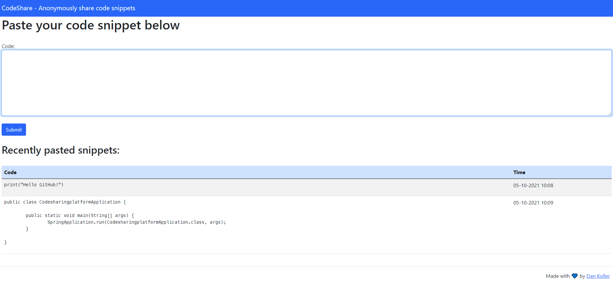

# Code sharing platform

This is a simple platform to copy, paste, share and receive code anonymously. I created it in order to learn more about
Spring Boot and the MVC architecture. Feel free to use or contribute to this repo as you like.

## Technologies used:

- Apache (WebServer)
- Java (Backend)
- Gradle (Build)
- Spring Boot (API, MVC)
- Bootstrap (CSS)
- Thymeleaf (HTML template engine)
- JavaScript (Send objects to API)

## How to use:

- **Build**: You can import this project as it is in an IDE (or editor) of your choice and build it with Gradle. I
  recommend JetBrains IntelliJ IDEA.

- **API**: There are a few endpoints which can be accessed:
    - `/api/code/new` to **post** new code to the server as **JSON** object e.g.:

            {
               "code": "print("hello world")"
            }

        - You can set a time restriction in seconds and view limit as well (A zero in either value means the absence of
          the restriction). This example (raw json body) posts a code snippet which can be viewed 2 times, but without
          time limit.:

              {
                "code": "public class Test {}",
                "time": 0,
                "views": 2
              }

    - `/api/code/latest` to **get** the most recent uploaded code (only non-restricted)
    - `/api/code/{uuid}` to **get** an element by its uuid (generated as return value on upload)

- **WEB**: Web endpoints are available as well:
    - `/code/new` to **post** new code to the server (You can set a time restriction in seconds and view limit)
    - `/code/latest` to **get** the most recent uploaded code (only non-restricted)
    - `/code/{uuid}` to **get** an element by its uuid (*generation will be available soon*)

### Needs improvement:

- Design can be upgraded (I just designed the basics, as I'm more of a backend developer :-))
- Display uuid in web to the user
